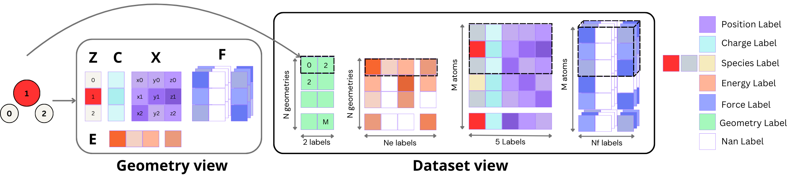

## Dataset structure

For a dataset with N geometries, M atoms across all geometries, ne energy labels,
and nf force labels, we use zarr or memory-mapped arrays of various sizes:

- (M, 5) for atomic numbers (1),
charges (1), and positions (3) of individual geometries;

- (N, 2) for the beginning and end indices of
each geometry in the previous array;

- (N, ne) for the energy labels of each geometry, extendable to
store other geometry-level QM properties such as HOMO-LUMO gap;

- (M, nf , 3) for the force labels
of each geometry, extendable to store other atom-level QM properties.

The memory-mapped files efficiently access data stored on disk or in the cloud without reading
them into memory, enabling training on machines with smaller RAM than the dataset size and
accommodating concurrent reads in multi-GPU training. This allows for very efficient indexing,
batching and iteration.

## Formats

We currently support the following formats:

1) Zarr : https://zarr.readthedocs.io/en/stable/index.html

2) Memmap : https://numpy.org/doc/stable/index.html
